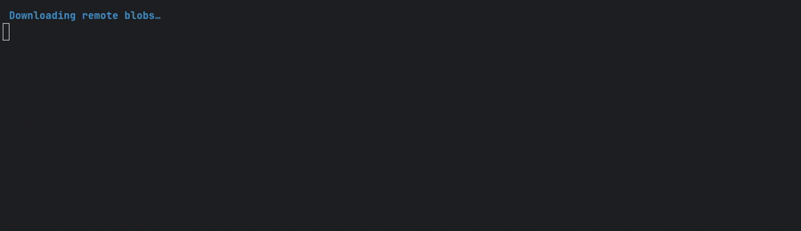

# Pull Remote Blob Rollup Plugin

[](https://nodejs.org/en/download)
[](https://github.com/aabmets/rollup-plugin-pull-remote-blob/blob/main/LICENSE)
[](https://codecov.io/gh/aabmets/rollup-plugin-pull-remote-blob)
[](https://github.com/aabmets/rollup-plugin-pull-remote-blob/actions/workflows/vitest-codecov.yaml)
[](https://www.npmjs.com/package/rollup-plugin-pull-remote-blob)

[](https://sonarcloud.io/summary/new_code?id=aabmets_rollup-plugin-pull-remote-blob)
[](https://sonarcloud.io/summary/new_code?id=aabmets_rollup-plugin-pull-remote-blob)
[](https://sonarcloud.io/summary/new_code?id=aabmets_rollup-plugin-pull-remote-blob)
[](https://sonarcloud.io/summary/new_code?id=aabmets_rollup-plugin-pull-remote-blob)<br/>
[](https://sonarcloud.io/summary/new_code?id=aabmets_rollup-plugin-pull-remote-blob)
[](https://sonarcloud.io/summary/new_code?id=aabmets_rollup-plugin-pull-remote-blob)
[](https://sonarcloud.io/summary/new_code?id=aabmets_rollup-plugin-pull-remote-blob)
[](https://sonarcloud.io/summary/new_code?id=aabmets_rollup-plugin-pull-remote-blob)

### _Now featured on [Awesome Rollup!](https://github.com/rollup/awesome)_

## CLI Progress Demo



## Overview

`rollup-plugin-pull-remote-blob` is a Rollup plugin designed to download remote files (blobs) during the build process. 
It allows you to specify remote resources, manage caching, and handle automatic decompression of downloaded archives. 
Because Vite is built on Rollup, you can also use this plugin in Vite projects.

## Features

- **Download:** Specify URLs where to download resources from and where the files should be saved to.
- **Caching:** Avoid redundant downloads by checking existing local files and verifying their integrity.
- **Error Handling** Option to halt waiting downloads when another download encounters an error (defaults to true).
- **Decompression Support:** Automatically decompress downloaded archives (we support _.zip_, _.tar_, _.tgz_ or _.tgz.bz2_).
- **Some Configurability:** You can use regex patterns and de-nesting to filter files when decompressing.

## Installation

```bash
npm install rollup-plugin-pull-remote-blob --save-dev
```
```bash
bun add rollup-plugin-pull-remote-blob --dev
```

## Usage
You can configure the plugin to download files as part of your Rollup build configuration. 
This plugin can be used with or without TypeScript; the types are handled automatically. 
Here is an example with all explained config options of how to use this plugin in your Rollup configuration:

```typescript
import { rollup } from 'rollup';
import { pullRemoteBlobPlugin } from 'rollup-plugin-pull-remote-blob';
import type { PluginConfig, DecompressionOptions } from 'rollup-plugin-pull-remote-blob';

rollup({
   input: 'src/index.js',
   plugins: [
      pullRemoteBlobPlugin({
         haltOnError: true,  // should other waiting downloads be halted when an error is encountered? Default is true
         showProgress: true,  // should download progress bars be displayed in the console? Default is true
         rollupHook: "closeBundle",  // during which Rollup stage the plugin should be executed? Default is "closeBundle"
         blobs: [
             {
                url: 'https://example.com/data.json',
                dest: './dist/data.json',  // relative paths are supported
                alwaysPull: true,  // useful for when the remote file contents are guaranteed to change
                prettyName: "Market Data"  // Alternate name to display in progress display instead of 'data.json'
             }, {
                url: 'https://example.com/some-asset.zip',
                dest: 'C:/Projects/my_project/dist/assets',  // absolute paths are also supported
                decompress: true,  // the files are extracted into the structure they have in the archive
                sizeBytes: 345000  // Override for when the plugin is unable to determine the remote file size
             }, {
                url: 'https://example.com/some-asset.zip',
                dest: './dist/assets.zip',  // will raise an error; path must be a directory when decompressing
                decompress: {
                   strip: 3,  // flatten the file structure when decompressing the archive by amount levels
                   filter: [  // can use a list of strings or RegExp objects to filter archive contents
                      "src/main.js", 
                      "package.json",
                      /^\w\d{3}.txt/,
                   ],  
                }
             }
         ]
      })
   ]
}).then(bundle => {
  // Output options...
});
```

## License
This project is licensed under the Apache-2.0 License - see the LICENSE file for details.
